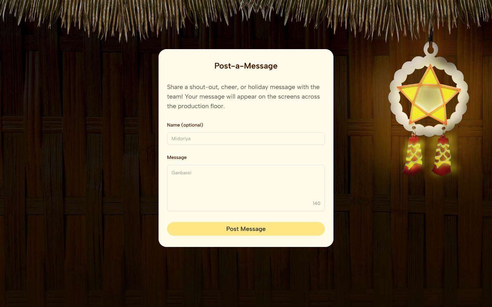
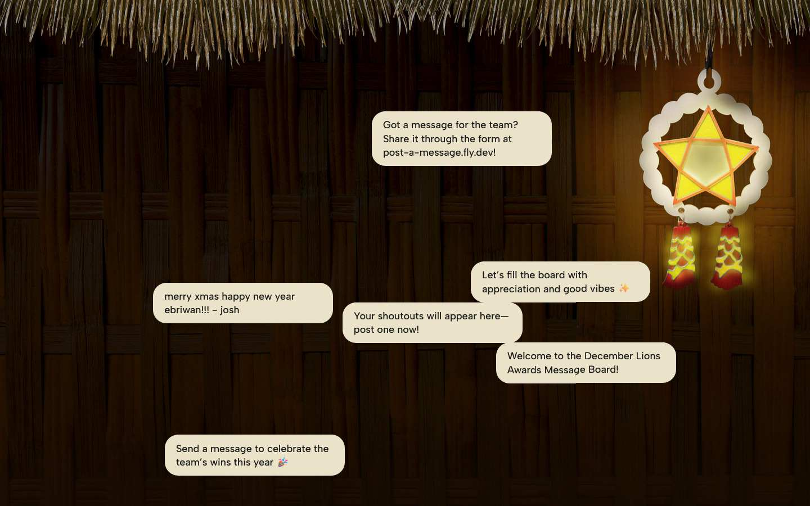

# Lions Message Board

Real-time message board for the December 2025 Lions Awards at BetMGM Manila.




This project contains a client (frontend) and a server (backend).

## Repository layout

- client/ — Frontend application (React)
- server/ — Backend API
- Dockerfile — Container setup for deployment
- fly.toml — Fly.io configuration

## Tech stack

This project uses TypeScript for both front- and back-end.

- Frontend: React, Matter.js, Tanstack Router
- Backend: Node.js, Express, MongoDB, Socket.IO
- Containerization: Docker

## Prerequisites

- Node.js (v20+ recommended)
- npm or yarn
- Docker (optional for development)

## Local development

1. Clone the repository:

   ```sh
   git clone <repo-url>
   cd lions-message-board
   ```

2. Start the server:

   ```sh
   cd server
   npm install
   npm run dev
   ```

3. Start the client (in a separate terminal):

   ```sh
   cd client
   npm install
   npm run dev
   ```

Adjust commands if the project uses yarn or pnpm.

## Environment

If the server or client require environment variables, add a `.env` file in the respective directory. Check the code in `server/` and `client/` for required variables and example values.

## Docker

A Dockerfile is included for building a container image. Example build and run:

   ```sh
   docker build -t lions-message-board .
   docker run -p 3000:3000 lions-message-board
   ```

Adjust ports and commands according to the project configuration.

## Contributing

Contributions and issues are welcome. Open a pull request with a clear description of changes and rationale.

## License

MIT.
